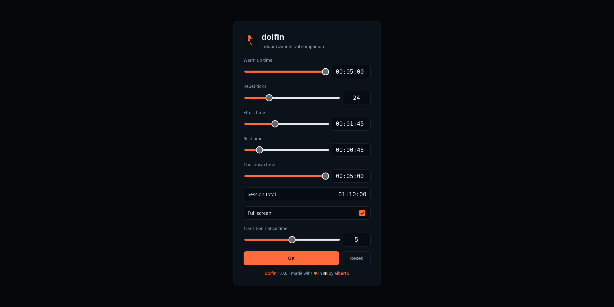
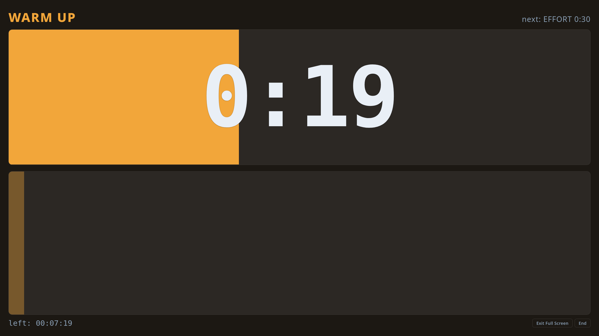
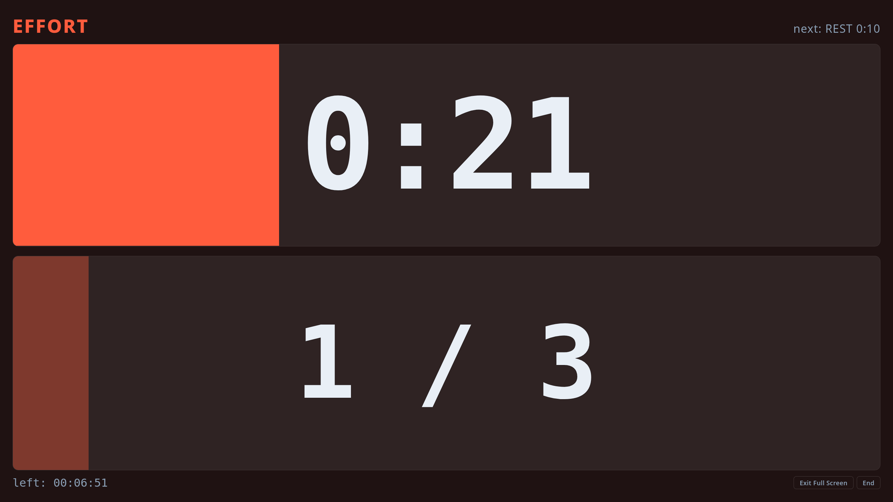
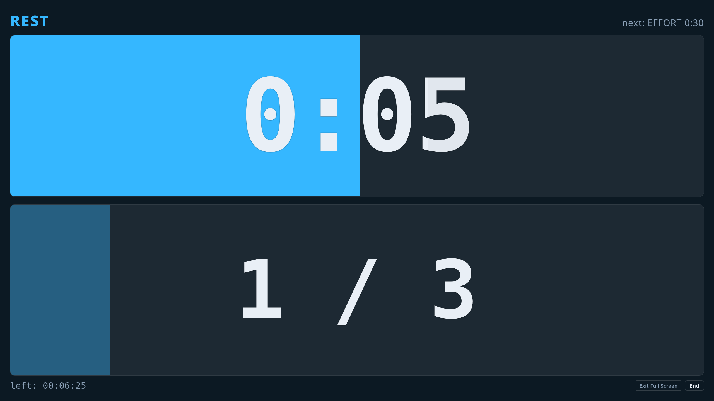
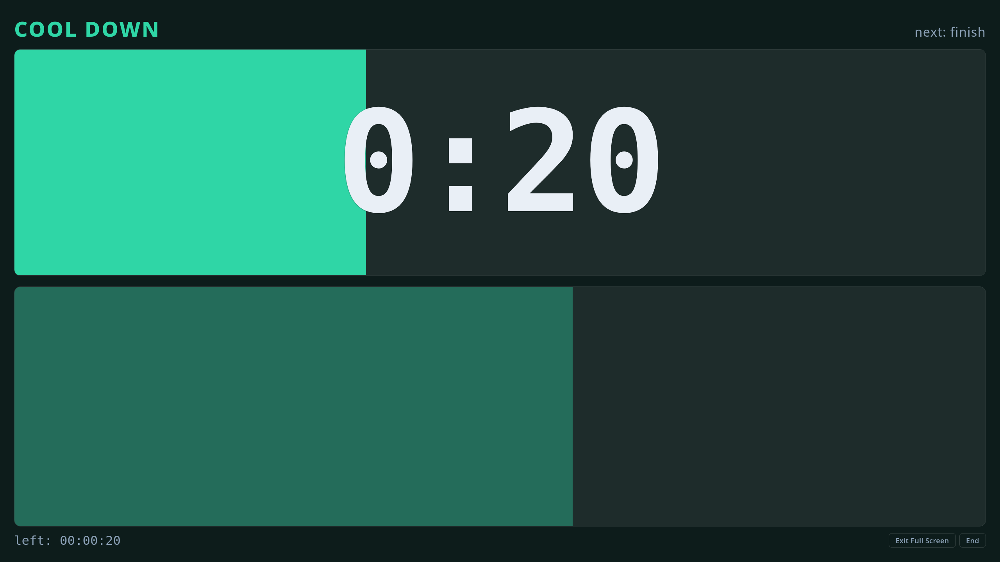
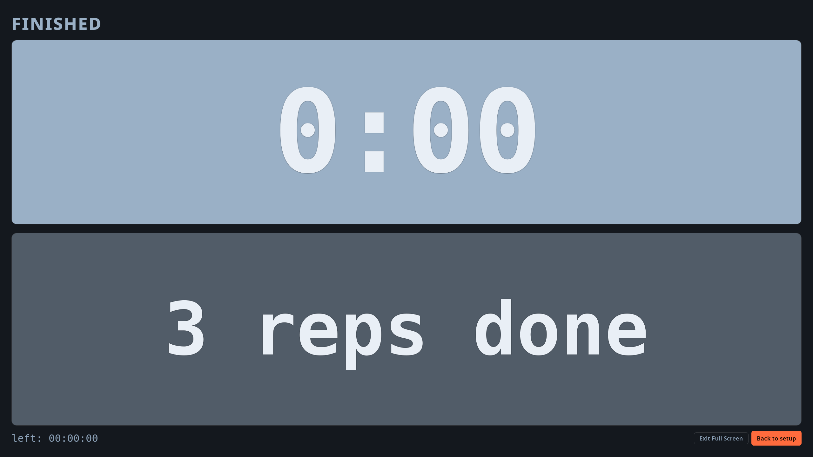

# dolfin

**dolfin** is your indoor row interval companion


## Overview

A full-screen interval timer that runs entirely in the browser,
built as a **visual companion** to the "Indoor row" activity
on my Garmin Instinct watch.

No backend, no build step, no dependencies: **dolfin** is made by just static files
that can be simply copied behind a Web server like `nginx`.

Optionally, **dolfin** installs as a PWA and works offline.


## Live Example

A live example of **dolfin** can be found at
[https://www.albertopettarin.it/dolfin/](https://www.albertopettarin.it/dolfin/)


## How It Works

There are two screens: the Setup Screen and the Timer Screen.

### Setup Screen



It is split into three tabs: "Intervals", "Programs" and "Customization".

**"Intervals"** describes a session one field at a time.
Its default values match the Garmin activity I use most frequently
(1h02m workout):

| Control        | Default    |
| -------------- | ---------- |
| Warm up time   | `00:01:00` |
| Repetitions    | `24`       |
| Effort time    | `00:01:45` |
| Rest time      | `00:00:45` |
| Cool down time | `00:01:00` |

**"Programs"** describes a session by picking a ready-made effort block
from a list, rather than typing it.
It has its own warm up and cool down times, independent of the ones on
"Intervals", and offers these programs,
written as `INT: (effort time + rest time) x repetitions`:

| Program                     | Program                     | Program                     |
| --------------------------- | --------------------------- | --------------------------- |
| `INT: (01:30 + 00:30) x 5`  | `INT: (01:45 + 00:45) x 4`  | `INT: (02:00 + 01:00) x 5`  |
| `INT: (01:30 + 00:30) x 10` | `INT: (01:45 + 00:45) x 6`  | `INT: (02:00 + 01:00) x 10` |
| `INT: (01:30 + 00:30) x 15` | `INT: (01:45 + 00:45) x 8`  | `INT: (02:00 + 01:00) x 15` |
| `INT: (01:30 + 00:30) x 20` | `INT: (01:45 + 00:45) x 12` | `INT: (02:00 + 01:00) x 20` |
| `INT: (01:30 + 00:30) x 30` | `INT: (01:45 + 00:45) x 16` | `INT: (02:00 + 01:00) x 25` |
| `INT: (01:30 + 00:30) x 45` | `INT: (01:45 + 00:45) x 18` | `INT: (02:00 + 01:00) x 30` |
| `INT: (01:30 + 00:30) x 60` | `INT: (01:45 + 00:45) x 20` | `INT: (02:00 + 01:00) x 40` |
|                             | `INT: (01:45 + 00:45) x 24` |                             |
|                             | `INT: (01:45 + 00:45) x 30` |                             |
|                             | `INT: (01:45 + 00:45) x 32` |                             |
|                             | `INT: (01:45 + 00:45) x 36` |                             |
|                             | `INT: (01:45 + 00:45) x 48` |                             |

The list opens on `INT: (01:45 + 00:45) x 24`,
the same block the "Intervals" defaults describe.

Both tabs show a read-only "Session total", and the tab you are on when you
press "Start" is the one that runs.
Switching to "Customization" does not change that choice.

**"Customization"** holds the preferences that apply to either kind of session:

| Control                    | Default    |
| -------------------------- | ---------- |
| Transition notice time (s) | `00:00:05` |
| Launch full screen         | `True`     |
| Allow skipping phase       | `False`    |

The "Transition notice time" represents how long before each phase ends
the countdown starts blinking and the blips start.
Set it to zero for no warning at all.

Time fields accept values in `hh:mm:ss`, `mm:ss`, or plain integer number of seconds
(e.g., `00:01:42`, `01:42` and `102` are all accepted).

The "Reset" button restores the default value.

The "Start" button starts the session, launching the timer screen ---
in fullscreen mode if "Launch full screen" is selected, otherwise non-fullscreen.

Values are remembered in `localStorage`, so the next visit starts where you left off.

### Timer Screen

The timer screen cycles through the defined intervals
warm-up → ( (effort → rest) × repetitions ) → cool-down.







A warm-up, effort, rest, or cool-down time of `00:00:00` simply skips that phase.

The screen is split into two horizontal bands:

- the top half shows the current phase name (and the next one up),
  with a progress bar and a timer counting down the current phase;
- the bottom half shows the overall workout progress,
  with a progress bar, the current repetition / total repetitions,
  and the time remaining for completing the workout.

On the bottom right corner there are three buttons:

- one to skip the current phase, jumping straight to the next one,
  shown only when "Allow skipping phase" is selected;
- one to go/exit fullscreen mode;
- one to end the workout and go back to the setup screen.

#### Audio Clues

Audio cues are synthesised (no files, so they work offline) short blips,
one per second through the transition notice window at the end of every phase.
A distinct tone plays when a phase starts: higher for effort, lower for everything else,
and three descending tones at the end of the session.

#### Controls

While a workout is running:

| Action                                          | Input                                                |
| ----------------------------------------------- | ---------------------------------------------------- |
| Pause / resume                                  | click/tap anywhere, or `Space`                       |
| Skip the current phase                          | the **Skip** button, when allowed                    |
| Enter or leave full screen, session carrying on | the **Go Full Screen** / **Exit Full Screen** button |
| End the session and go back to setup            | the **Stop** button, or `Esc`                        |

The screen is kept awake for the duration of the workout
via the Screen Wake Lock API where the browser supports it,
and the clock is anchored to wall time,
so it does not drift if the tab is backgrounded.


## Layout

```
.
├── README.md
├── LICENSE
└── dolfin/            <- this directory is the document root
    ├── index.html
    ├── style.css
    ├── dolfin.js      <- everything: parsing, timeline, clock, cues, wake lock
    ├── manifest.json
    ├── precache.js    <- service worker
    ├── icon.svg
    └── icon-180.png, icon-192.png, icon-512.png
```


## Running It Locally

```sh
cd dolfin
python3 -m http.server 8080
```

then open in your browser
[http://localhost:8080](http://localhost:8080) .

> [!TIP]
> `localhost` counts as a secure context,
> so the service worker registers and offline mode can be tested there.


## Deploying Behind `nginx`

Simply copy the `dolfin/` directory into a location served by `nginx`.

A secure context is needed, that is, serve over HTTPS
(but, hey, it's 2026, you should use HTTPS always, everywhere, anyway!).

A live example can be found at
[https://www.albertopettarin.it/dolfin/](https://www.albertopettarin.it/dolfin/)


## Browser Support

Any reasonably recent browser is supported.

`AudioContext`, `localStorage`, the Fullscreen API,
and the Screen Wake Lock API are each used defensively:
if a browser lacks support for a feature,
that feature is skipped and the timer itself is unaffected.

On iOS the way to get a full-screen session
is to install dolfin to the home screen,
where it opens without browser chrome anyway.


## Licence

This project is licensed under the MIT License.

See the
[LICENSE](https://github.com/pettarin/dolfin/blob/main/LICENSE)
file for details.


## Authors

- Alberto Pettarin ([Web](https://www.albertopettarin.it))


## About The Name **dolfin**

**Dolfin** is the Venetian-dialect name for the iron comb on the bow of a
[gondola](https://it.wikipedia.org/wiki/Gondola),
the *ferro di prua*, whose six forward teeth stand for the six *sestieri* of Venice,
while the single rear tooth stands for the Giudecca,
and the arch above the top tooth is traditionally read as the Rialto bridge.

Note how the icon of the app is a stylized version of a **dolfin**,
traced from a photograph of the real thing.


## Legal Disclaimers

This project and its authors are not affiliated
nor (unfortunately) endorsed or supported by
[Dolfin](https://dolfin.it/en),
the company producing the mythical
[Polaretti](https://www.polaretti.it/en)
icicles.

