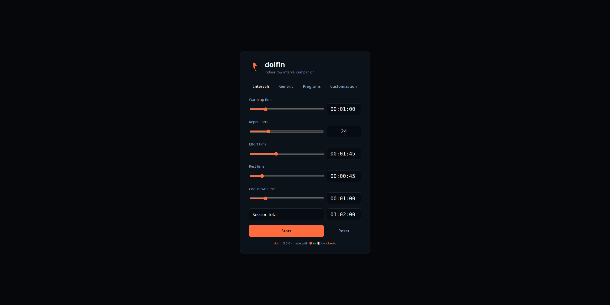
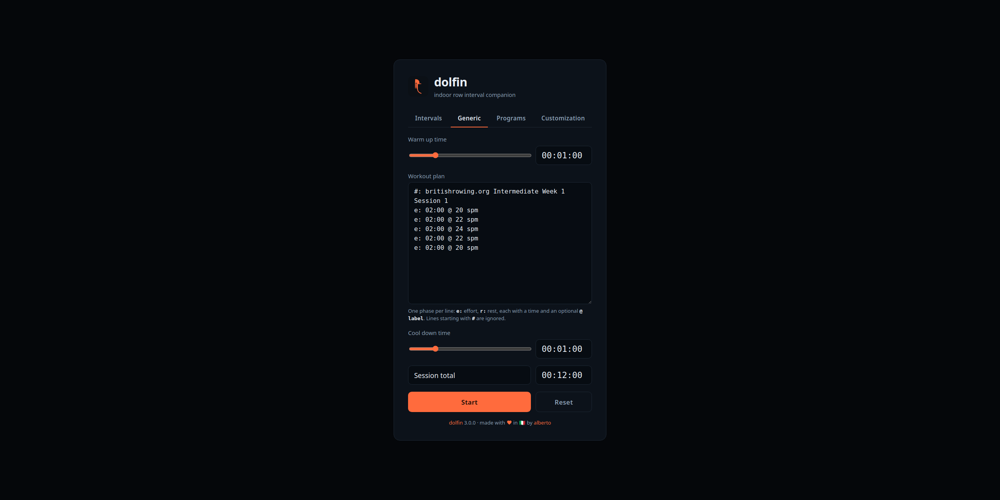
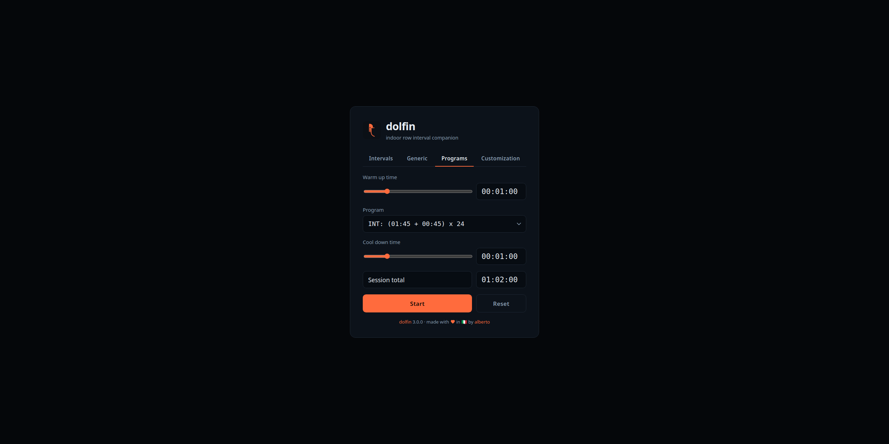
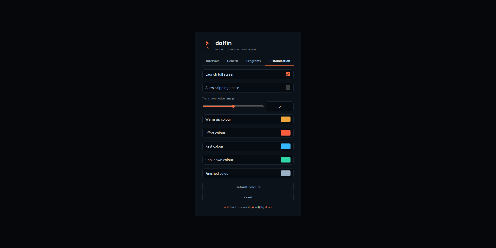
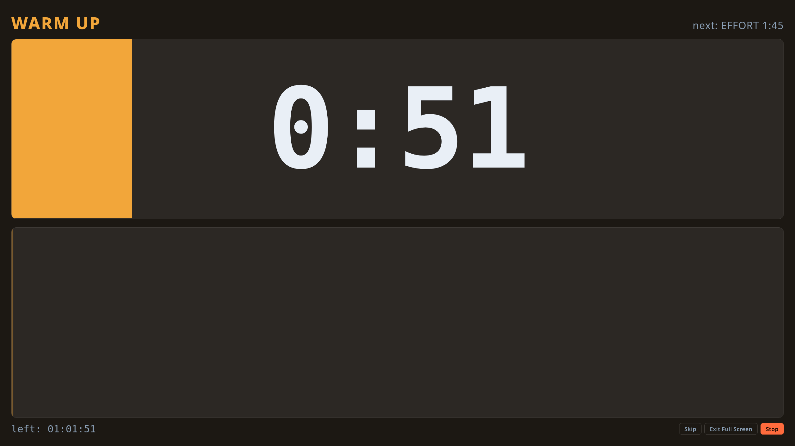
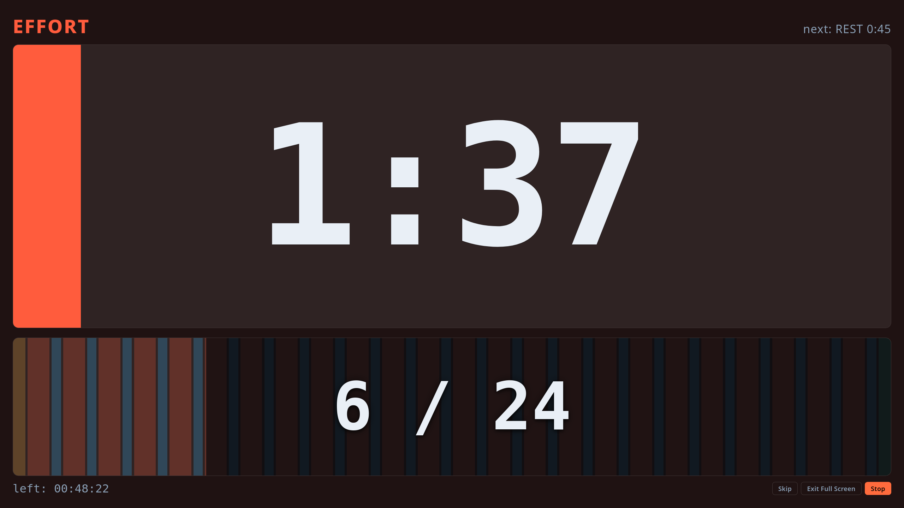
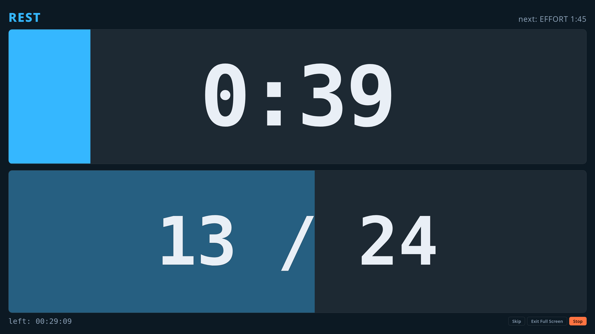
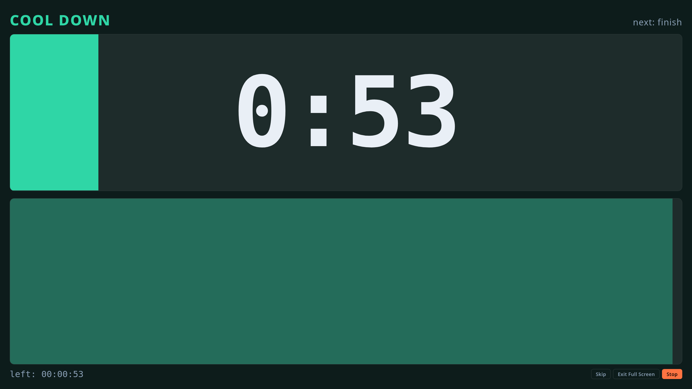
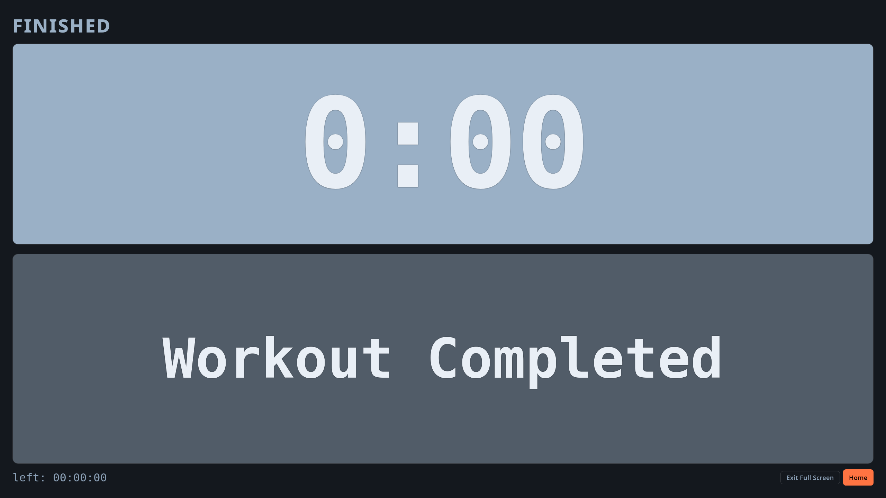
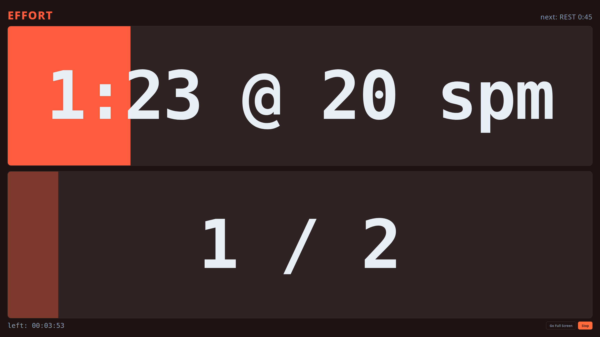

# dolfin

**dolfin** is your indoor row interval companion


## Overview

A full-screen interval timer that runs entirely in the browser,
built as a **visual companion** to the "Indoor row" activity
on my Garmin Instinct watch.

No backend, no build step, no dependencies:
**dolfin** is made by just static files
that can be simply copied behind a Web server like `nginx`.

Optionally, **dolfin** installs as a PWA and works offline.


## Live Example

A live example of **dolfin** can be found at
[https://www.albertopettarin.it/dolfin/](https://www.albertopettarin.it/dolfin/)


## How It Works

There are two screens: the **Setup** screen and the **Workout** screen.

### Setup Screen

It is split into four tabs:
**Intervals**, **Generic**, **Programs**, and **Customization**.

#### Intervals Tab



The **"Intervals"** tab lets the user
set up a workout session made by repetitions of effort and rest phases,
plus optional warm up and cool down phases.

Its default values match the Garmin activity I use most frequently:

| Control        | Default    |
| -------------- | ---------- |
| Warm up time   | `00:01:00` |
| Repetitions    | `24`       |
| Effort time    | `00:01:45` |
| Rest time      | `00:00:45` |
| Cool down time | `00:01:00` |

A warm up, effort, rest, or cool down time of `00:00:00`
simply skips that phase.

Press the **Start** button to transition to the Workout screen.

#### Generic Tab



The **"Generic"** tab lets the user write out a workout
that is not a plain repetition of the same effort and rest,
plus optional warm up and cool down phases.

The plan is written one phase per line:

| Line                | Meaning                                         |
| ------------------- | ----------------------------------------------- |
| `e: 02:00`          | an effort phase, two minutes long                |
| `r: 01:30`          | a rest phase, ninety seconds long                |
| `e: 02:00 @ 20 spm` | an effort phase, labelled `20 spm`               |
| `#: anything`       | a comment, ignored (any line starting with `#`)  |
| `e: 01:00 ; r: 30`  | two phases on one line, separated by `;`         |

Times accept the same `hh:mm:ss`, `mm:ss` or plain-seconds forms
as every other time field, and must be greater than zero.
Blank lines are ignored,
and `e` and `r` may be written in upper case.

Anything after an `@` is a free-text label:
it is shown next to the countdown, as big as it,
for the whole phase it belongs to.
The two are sized together to fill the bar,
so a long label makes for a smaller reading.
Rowing plans typically use it for a stroke rate,
but any short text will do.

For example, this plan:

```
#: britishrowing.org Intermediate Week 1 Session 1
e: 02:00 @ 20 spm
e: 02:00 @ 22 spm
e: 02:00 @ 24 spm
e: 02:00 @ 22 spm
e: 02:00 @ 20 spm
```

runs five two-minute efforts back to back,
each announcing the stroke rate to hold,
and is the one the tab opens on:

| Control        | Default                    |
| -------------- | -------------------------- |
| Warm up time   | `00:01:00`                 |
| Workout plan   | the five-effort plan above |
| Cool down time | `00:01:00`                 |

A few more examples, taken from the
[British Rowing](https://www.britishrowing.org) intermediate training programme,
are in the `res/` directory.

If a line cannot be read, the **Session total** shows `—`,
and pressing **Start** reports which line is at fault.

Press the **Start** button to transition to the Workout screen.

#### Programs Tab



The **"Programs"** tab lets the user pick one of the pre-defined workouts,
plus optional warm up and cool down phases.

> [!NOTE]
> Currently (``v3.0.0``) only interval-type programs are included.
> Any other workout can be written out by hand in the **Generic** tab.

The included programs are:

| Program                     | Description                              |
| --------------------------- | ---------------------------------------- |
| `INT: (01:30 + 00:30) x 5`  | Intervals: (effort + rest) x repetitions |
| `INT: (01:30 + 00:30) x 10` |                                          |
| `INT: (01:30 + 00:30) x 15` |                                          |
| `INT: (01:30 + 00:30) x 20` |                                          |
| `INT: (01:30 + 00:30) x 30` |                                          |
| `INT: (01:30 + 00:30) x 45` |                                          |
| `INT: (01:30 + 00:30) x 60` |                                          |
| `INT: (01:45 + 00:45) x 4`  |                                          |
| `INT: (01:45 + 00:45) x 6`  |                                          |
| `INT: (01:45 + 00:45) x 8`  |                                          |
| `INT: (01:45 + 00:45) x 12` |                                          |
| `INT: (01:45 + 00:45) x 16` |                                          |
| `INT: (01:45 + 00:45) x 18` |                                          |
| `INT: (01:45 + 00:45) x 20` |                                          |
| `INT: (01:45 + 00:45) x 24` |                                          |
| `INT: (01:45 + 00:45) x 30` |                                          |
| `INT: (01:45 + 00:45) x 32` |                                          |
| `INT: (01:45 + 00:45) x 36` |                                          |
| `INT: (01:45 + 00:45) x 48` |                                          |
| `INT: (02:00 + 01:00) x 5`  |                                          |
| `INT: (02:00 + 01:00) x 10` |                                          |
| `INT: (02:00 + 01:00) x 15` |                                          |
| `INT: (02:00 + 01:00) x 20` |                                          |
| `INT: (02:00 + 01:00) x 25` |                                          |
| `INT: (02:00 + 01:00) x 30` |                                          |
| `INT: (02:00 + 01:00) x 40` |                                          |

Press the **Start** button to transition to the Workout screen.

#### Customization Tab



The **"Customization"** tab holds the preferences that apply
to the workout screen, for **Intervals**, **Generic**
or **Programs** workouts:

| Control                    | Default                 |
| -------------------------- | ----------------------- |
| Launch full screen         | `True`                  |
| Allow skipping phase       | `False`                 |
| Transition notice time (s) | `00:00:05`              |
| Warm up colour             | `#f2a63a` (dark yellow) |
| Effort colour              | `#ff5c3d` (light red)   |
| Rest colour                | `#35b7ff` (light blue)  |
| Cool down colour           | `#2fd6a6` (light green) |
| Finished colour            | `#9ab0c6` (grey)        |

The **Transition notice time** setting represents
how long before each phase ends
the countdown starts blinking and the blips start.
Set it to zero for no warning at all.

Time fields accept values in `hh:mm:ss`, `mm:ss`,
or plain integer number of seconds
(e.g., `00:01:42`, `01:42` and `102` are all accepted).

The **Default colours** button restores just the colour values,
leaving the times, the workout plan and the chosen program alone.

The **Reset** button restores the default value for all controls.

Values are saved in `localStorage`,
so the next visit starts with the last values set
(possibly different than the default values).

### Workout Screen

The **Workout** screen cycles through the defined phases:
warm up → ( (effort → rest) × repetitions ) → cool down → end of workout.
Immediately below a screenshots of each phase:







A phase of a **Generic** workout that carries a label
shows it right next to the countdown:



The screen is split into two horizontal bands:

- the top half shows the current phase name (and the next one up),
  with a progress bar, a timer counting down the current phase,
  and the phase label, if it has one;
- the bottom half shows the overall workout progress,
  with a progress bar, the current repetition / total repetitions,
  and the time remaining for completing the workout.

On the bottom right corner there are three buttons:

- **Skip**, shown only when the **Allow skipping phase** setting is selected,
  to skip the current phase and jump to the next one;
- **Go Full Screen/Exit Full Screen** to toggle the full screen mode;
- **Stop** to end the workout and go back to the setup screen.

#### Audio Clues

Audio cues are synthesised short blips,
one per second through the transition notice window at the end of every phase.
A distinct tone plays when a phase starts:
higher for effort, lower for everything else,
and three descending tones at the end of the session.

#### Controls

While a workout is running:

| Action                                           | Input                                                          |
| ------------------------------------------------ | -------------------------------------------------------------- |
| Pause / resume                                   | click/tap anywhere, or press the `Space` key                   |
| Skip the current phase                           | click/tap the **Skip** button                                  |
| Enter or leave full screen, session carrying on  | click/tap the **Go Full Screen** / **Exit Full Screen** button |
| Stop the workout and go back to the Setup screen | click/tap the **Stop** button, or press the `Esc` key          |

The screen is kept awake for the duration of the workout
via the Screen Wake Lock API where the browser supports it,
and the clock is anchored to wall time,
so it does not drift if the tab is backgrounded.


## Layout

```
.
├── AGENTS.md                           <- directions for coding agents
├── docs                                <- documentation
│   ├── CHANGELOG.md
│   ├── CODE_OF_CONDUCT.md
│   ├── CONTRIBUTING.md
│   ├── DEVELOPMENT.md
│   ├── ROADMAP.md
│   └── SECURITY.md
├── dolfin                              <- document root, can be served behind a Web server
│   ├── dolfin.js                       <- main script
│   ├── icon-180.png
│   ├── icon-192.png
│   ├── icon-512.png
│   ├── icon.svg
│   ├── index.html
│   ├── manifest.json                   <- PWA manifest
│   ├── precache.js                     <- service worker
│   └── style.css
├── imgs                                <- screenshots for the README
│   ├── phases_cool_down.png
│   ├── phases_effort.png
│   ├── phases_effort_label.png
│   ├── phases_end_of_workout.png
│   ├── phases_rest.png
│   ├── phases_warm_up.png
│   ├── setup_customization.png
│   ├── setup_generic.png
│   ├── setup_intervals.png
│   └── setup_programs.png
├── LICENSE
├── Makefile
├── README.md                           <- this README file
├── res                                 <- example plans for the Generic tab
│   └── british_rowing_org
└── VERSION                             <- version of dolfin
```


## Running It Locally

```sh
cd dolfin
python3 -m http.server 8888
```

or

```sh
make serve
```

then open in your browser
[http://localhost:8888](http://localhost:8888) .

> [!TIP]
> `localhost` counts as a secure context,
> so the service worker registers and offline mode can be tested there.


## Deploying Behind `nginx`

Simply copy the `dolfin/` directory into a location served by `nginx`.

A live example can be found at
[https://www.albertopettarin.it/dolfin/](https://www.albertopettarin.it/dolfin/)

> [!NOTE]
> A secure context is needed, that is, serve over HTTPS ---
> but, hey, it's 2026, you should use HTTPS always, everywhere, anyway!


## Browser Support

Any reasonably recent browser is supported.

`AudioContext`, `localStorage`, the Fullscreen API,
and the Screen Wake Lock API are each used defensively:
if a browser lacks support for a feature,
that feature is skipped and the timer itself is unaffected.

On iOS the way to get a full-screen session
is to install dolfin to the home screen,
where it opens without browser chrome anyway.


## Licence

This project is licensed under the MIT License.

See the
[LICENSE](https://github.com/pettarin/dolfin/blob/main/LICENSE)
file for details.


## Authors

- Alberto Pettarin ([Web](https://www.albertopettarin.it))


## About The Name **dolfin**

**Dolfin** is the Venetian-dialect name for the iron comb on the bow of a
[gondola](https://it.wikipedia.org/wiki/Gondola),
the *ferro di prua*, whose six forward teeth stand for the six *sestieri* of Venice,
while the single rear tooth stands for the Giudecca,
and the arch above the top tooth is traditionally read as the Rialto bridge.

Note how the icon of the app is a stylized version of a **dolfin**,
traced from a photograph of the real thing.


## Legal Disclaimers

This project and its authors are not affiliated
nor (unfortunately) endorsed or supported by
[Dolfin](https://dolfin.it/en),
the company producing the mythical
[Polaretti](https://www.polaretti.it/en)
icicles.

